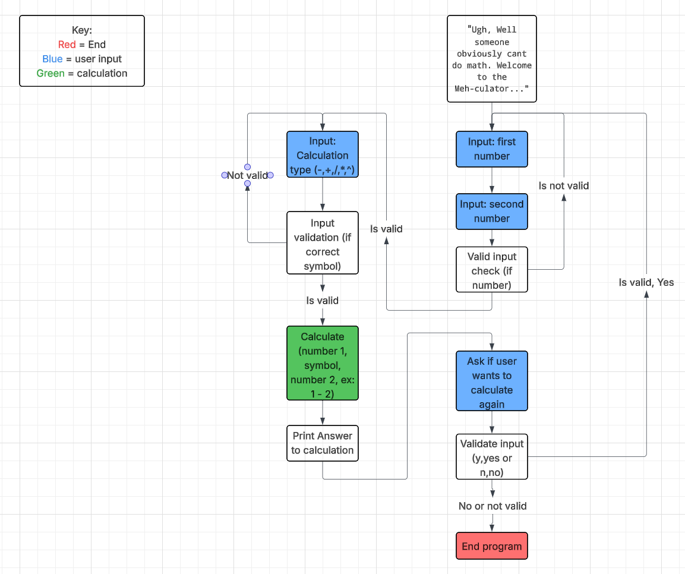
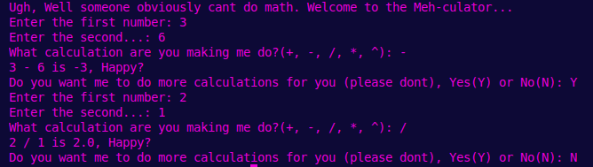
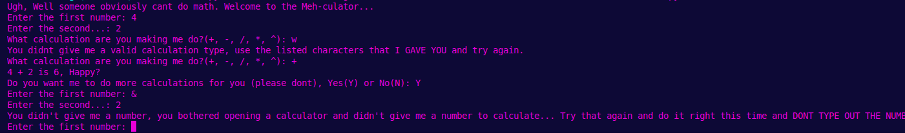

# The 'Meh'-Thematical calculator README
A calculator that is just **REALLY** fed up with it's job
### Requirements
- Python 3 or higher
- Any IDE to run Python
### Installation
###### In linux terminal  
- git clone https://github.com/WTCSC/the-meh-thematical-calculator-OwenVWest.git
- cd the-meh-thematical-calculator-OwenVWest
- python3 MEHculator.py
### Decision Tree
###### What inputs will do what

### Input examples
###### Valid input examples:  
1.)first number: 3  
2.)second number: 5  
3.)calculation type: +  
4.)result = 8  
###### Invalid input examples:
1.)first number: -1  
2.)second number: 4  
3.)calculation type: -  
4.)result = error (Program cannot handle negative numbers)  
 
1.)first number: w  
2.)second number: 8  
3.)calculation type: ^  
4.)result = error (Program cannot handle letters)
 
 
1.)first number: 9  
2.)second number: 23  
3.)calculation type: %  
4.)result = error (Program only provides the ^,+,-,* calculation types)
 
### Configuration
_N/A_ (None Needed)
### How the result appears
###### Here are a few examples of the program being used with different inputs and how it responds
###### A valid use

###### An invalid use

### How to run tests
Once you are in the correct directory (cd the-meh-thematical-calculator-OwenVWest)  
Run (pytest -s) to run the tests for the program
