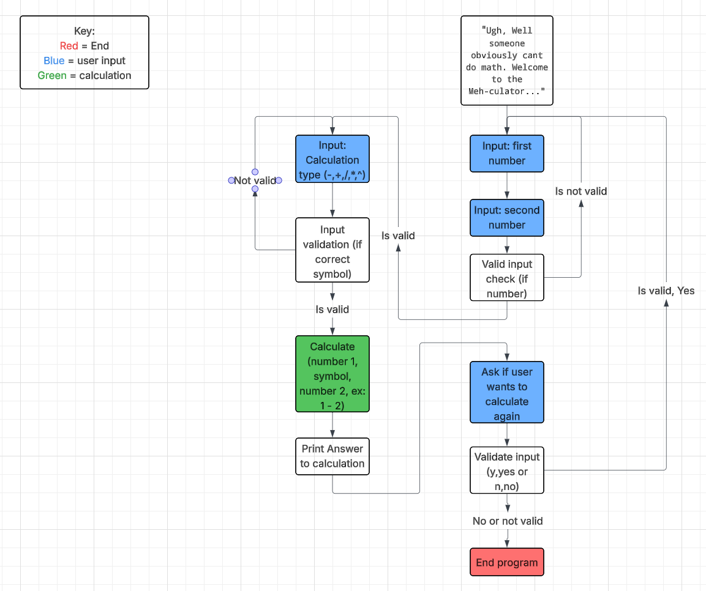

# The 'Meh'-Thematical calculator README
A calculator that is just **REALLY** fed up with it's job
### Requirements
- Python 3 or higher
- Any IDE to run Python
### Installation
###### In linux terminal  
- git clone https://github.com/WTCSC/the-meh-thematical-calculator-OwenVWest.git
- cd the-meh-thematical-calculator-OwenVWest
- python3 MEHculator.py
### Decision Tree
###### What inputs will do what

